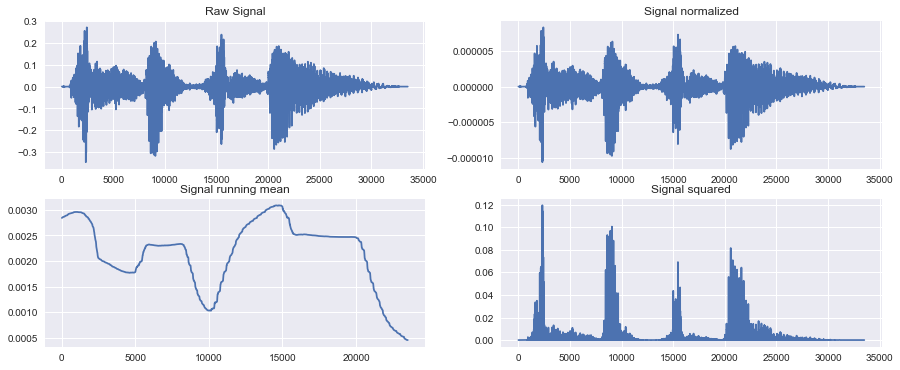
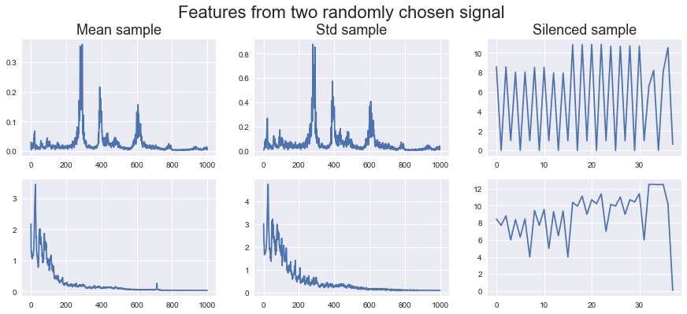
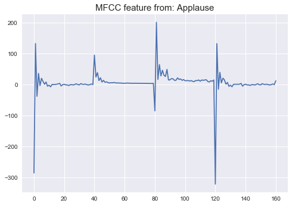

# Freesound Audio Classification

The aim of this project is to classify audio files which are taken from real life senarios for example music instruments, machines, animals, humans etc. 
Out of these few are labelled but not all. Which is what is challenging 

Data is taken from the [Freesound general purpose Audio tagging challenge](https://www.kaggle.com/c/freesound-audio-tagging). 

## Feature Extractions
Multiple feature extraction methods are performed. Signals are pre-processed using bit normalization and computing running means. A single sample preprocessing looks like this. 

Shape, Width, No of zero crossings and no of peaks in a spectrum are computed. 

MFCC from the samples generated and running mean, sd, max and med from each sample are collated as below.

